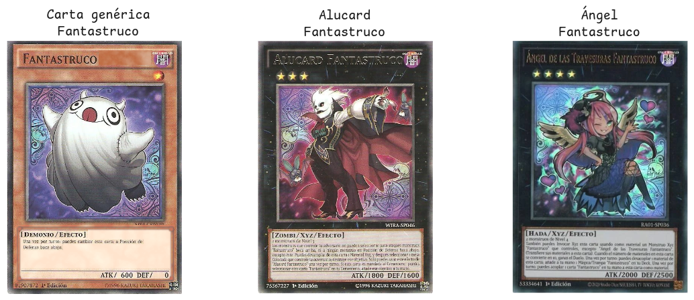
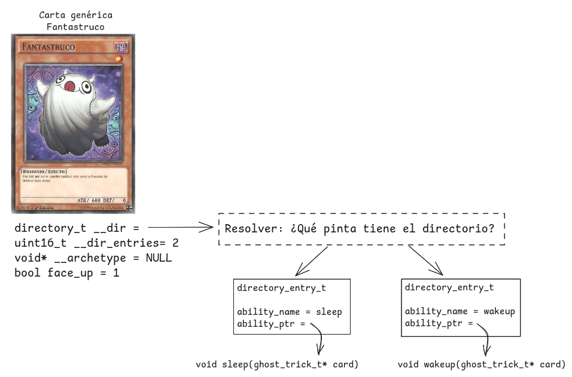
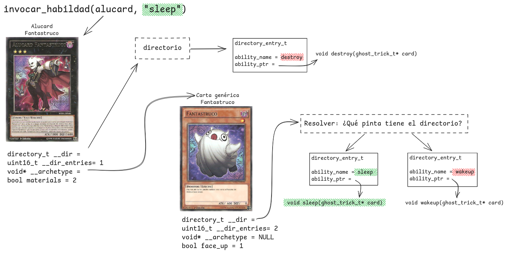

[](https://classroom.github.com/a/HQiE2j1m)
# Primer parcial - Arquitectura y Organización del Computador
### Primer cuatrimestre 2025

- [Primer parcial - Arquitectura y Organización del Computador](#primer-parcial---arquitectura-y-organización-del-computador)
		- [Primer cuatrimestre 2025](#primer-cuatrimestre-2025)
- [Normas generales y modalidad de entrega](#normas-generales-y-modalidad-de-entrega)
	- [Régimen de Aprobación](#régimen-de-aprobación)
	- [Conocimientos a evaluar](#conocimientos-a-evaluar)
	- [Compilación y Testeo](#compilación-y-testeo)
	- [Verificación de tests](#verificación-de-tests)
- [Enunciado](#enunciado)
	- [Las cartas monstruo](#las-cartas-monstruo)
	- [Ejercicio 1](#ejercicio-1)
	- [Ejercicio 2](#ejercicio-2)


# Normas generales y modalidad de entrega

- El parcial es **INDIVIDUAL**
- Una vez terminada la evaluación se deberá crear un PR a `main` con la branch con la resolución como source.
- Deben informar su entrega en el siguiente formulario, enviando el link al PR con sus cambios finales y los tests corridos (ver sección [Verificación de tests](#verificación-de-tests)):

https://docs.google.com/forms/d/e/1FAIpQLScbzZoXGJbg1NdZBH13Jv22zrO0VEYVjf6Cm-jS3s_EEtypcQ/viewform?usp=sharing

> [!CAUTION]
> Es importante que no modifiquen los archivos de los tester, si lo hacen se nos advertirá y tendremos que desaprobar la entrega automáticamente.
> 
> **No se deben modificar manualmente:**
> - las carpetas test_utils y .github
> - los archivos tester.sh, test.c y test_ej2.c
> - los Makefiles

## Régimen de Aprobación

- El parcial es en los laboratorios, usando las compus de los labos o sus propias compus.
- Es a libro abierto, pueden tener todo lo que se les ocurra a disposición. Recomendamos evitar el uso de IA, en esta materia suele equivocarse y no es fácil encontrar errores en código no propio de C o ASM.
- **Sólo se evalúa programación en Assembly**. SIMD no entra en el parcial y **C no se corrije** pero recomendamos que primero planteen la solución en C y después pasarla a Assembly.
- Para aprobar el parcial deben implementar todos los puntos del enunciado y que corran con éxito los tests funcionales, de abi y de memoria (valgrind).
- Vamos a usar herramientas de detección de plagio para asegurarnos de que su entrega sea original. 

> [!NOTE]
> El comando `./tester.sh` corre los mismos tests que el juez online. Pueden usarlo para revisar que su parcial vaya a pasar los tests en dicho entorno.

> [!NOTE]
> Durante el parcial estaremos disponibles para resolver consultas de enunciado y para destrabarles si están dando vueltas mucho tiempo en algo que no forma parte de lo evaluado. NO responderemos preguntas teóricas.


## Conocimientos a evaluar 
- Uso de memoria dinámica.
- Navegación de punteros.
- Representación binaria de los tipos de datos.
- Manejo de pila.
- Manejo de structs.
- Convención C, ABI, uso de registros.
- Uso del debugger GDB.

## Compilación y Testeo

Para compilar y ejecutar los tests cada ejercicio dispone de un archivo
`Makefile` con los siguientes *targets*:

| Comando             | Descripción                                                         |
| ------------------- | ------------------------------------------------------------------- |
| `make test_c`       | Genera el ejecutable usando la implementación en C del ejercicio.   |
| `make test_asm`     | Genera el ejecutable usando la implementación en ASM del ejercicio. |
| `make test_abi`     | Genera usando la implementación en ASM del ejercicio + archivos necesarios para ABI enforcer |
| `make run_c`        | Corre los tests usando la implementación en C.                      |
| `make run_asm`      | Corre los tests usando la implementación en ASM.                    |
| `make run_abi`      | Corre los tests usando la implementación en ASM + ABI enforcer.     |
| `make valgrind_c`   | Corre los tests en valgrind usando la implementación en C.          |
| `make valgrind_asm` | Corre los tests en valgrind usando la implementación en ASM.        |
| `make valgrind_abi` | Corre los tests en valgrind usando la implementación en ASM + ABI enforcer        |
| `make run_main_c`        | Corre main usando la implementación en C.                      |
| `make run_main_asm`      | Corre main usando la implementación en ASM (no corre ABI enforcer).                    |
| `make clean`        | Borra todo archivo generado por el `Makefile`.                      |

El ejercicio 1 de este parcial tiene dos incisos. **Sólo se correrán los tests
de los incisos que hayan marcado como hechos.** Para esto deben modificar la
variable `EJERCICIO_1A_HECHO` ó `EJERCICIO_1B_HECHO` según corresponda
asignándo `true` (en C) ó `TRUE` (en ASM).

## Verificación de tests
Para el parcial, contamos con una máquina de la facultad para correr los tests en un entorno limpio y controlado. La idea es que ustedes trabajen en su branch, haciendo los commits y push que necesiten, hasta tener los tests pasando en su computadora local.

> [!CAUTION]
> Para considerar un ejercicio aprobado, debe pasar los tests **con el comando** `make valgrind_abi`

Una vez que tengan el parcial para entregar, proceden a revisar su aprobación del siguiente modo:
- Crean un PR de `su branch` a `main` con los cambios a entregar
- **PARA CORRER LOS TESTS, DEBEN AGREGAR UNA ETIQUETA (label) AL PR**, verán en su repositorio que aparece una label `tests` a tal fin
- Cuando se detecte que agregaron la label, denle uno o dos minutos y comenzarán a correr los tests. El estado se informará en la ventana del PR donde figura el botón para hacer merge.
- Eventualmente terminarán los tests y dirá si pasaron (aprobado) o no. Pueden revisar el progreso si hacen click en el nombre de la corrida en curso.
- **No hacer el merge a main del PR**

> [!NOTE]
> Si hacen cambios y quieren volver a correr los tests, deben SACAR LA ETIQUETA, guardar el cambio (pueden refrescar la pagina por ejemplo) Y VOLVER A AGREGAR LA ETIQUETA

# Enunciado

La cátedra está trabajando en un innovador juego de cartas llamado Ah-Yi-Ok! donde dos jugadores podrán batallar por turnos utilizando mazos de 40 cartas que representan monstruos u otras trampas situacionales.
Cada jugador comienza con 8000 puntos de vida que irán disminuyendo a medida que el jugador contrario lo ataque utilizando monstruos y otras trampas.
La partida termina cuando la vida de un jugador llega a 0 o alguno de los jugadores no tiene más cartas en su mazo.

Las partidas (batallas) se desarrollan en turnos sucesivos, donde los jugadores ponen en juego los distintos monstruos y trampas con los que dañar a su contrincante.
Para hacer daño, **los monstruos tienen una o más habilidades** que pueden activar una vez por turno siempre que se encuentren en juego, es decir en la mesa, boca arriba.

Actualmente, la cátedra busca implementar las cartas monstruo.

## Las cartas monstruo
Todos los monstruos de nuestro juego pertenecen a algún **arquetipo**.
Cada arquetipo está compuesta de cartas genéricas y de "jefes" de mayor valor.
Todas las cartas del arquetipo cuentan con una o más **habilidades en común** correspondientes al arquetipo.
Además, las cartas de tipo "jefe" cuentan con una o más **habilidades especiales** adicionales a las habilidades en común del arquetipo.

Queremos implementar cartas que pertenecen al arquetipo *Fantastruco*. Una de las habilidades en común del arquetipo es que todas sus cartas pueden "irse a dormir" (habilidad `sleep`).
Cuando se ejecuta la habilidad `sleep`, la carta queda boca abajo hasta el comienzo del próximo turno, lo cual la protege de ciertas habilidades enemigas pero evita que pueda invocar otras de sus propias habilidades.

Alucard y Ángel son jefes del arquetipo *Fantastruco*, por lo que además de la habilidades especiales mencionadas en sus correspondientes descripciones, tienen implícita la habilidad en común `sleep` que se encuentra en la descripción de la carta genérica *Fantastruco*.



## Ejercicio 1
Ya está implementado el tipo de las cartas básicas del arquetipo *Fantastruco*, las cuales tienen la habilidad en común `sleep` (irse a dormir).
Para poder implementar dicha habilidad, **todas las cartas del arquetipo** instancian un struct `fantastruco_t` que contiene el atributo `bool face_up` que indica si la carta está boca arriba (1) o no (0).
```c
typedef struct {
	directory_t __dir;
	uint16_t __dir_entries;
	void* __archetype; //Es NULL
	bool face_up;
} fantastruco_t;
```

En el atributo `__dir` se encuentra un directorio de las habilidades implementadas por la carta.
Dicho directorio se compone de entradas de tipo `directory_entry_t` que contienen el nombre de la habilidad implementada y un puntero a la función que ejecuta dicha habilidad.

El atributo `__dir_entries` indica cuántas entradas hay en el directorio.
Por ejemplo, si un monstruo genérico fantastruco implementa dos habilidades del arquetipo, `sleep` y `wakeup`, `__dir_entries = 2` indicando que hay dos `directory_entry_t`.

```c
typedef directory_entry_t** directory_t; //pista: atención a esta definición

typedef struct {
	char ability_name[10]; //pista: atención al tipo de este atributo !!!
	void* ability_ptr;
} directory_entry_t;
```



Resolver:
1. **Implementar en ASM la función** `void init_fantastruco_dir(fantastruco_t* card)` que inicialice los atributos `__dir` y `__dir_entries` de la carta pasada por parámetro. Se debe incluir en el directorio entradas para las habilidades `sleep` y `wakeup`, que están implementadas en `fantastruco.c`
2. **Implementar en ASM la función** `fantastruco_t* summon_fantastruco()` que devuelve un puntero a una carta fantastruco genérica con todos sus atributos inicializados apropiadamente. La carta debe ser creada boca arriba (`face_up = 1`) y con el atributo `__archetype = NULL`.

> [!IMPORTANT]
> El tester liberará la memoria devuelta por esta función.

> [!CAUTION]
> Para crear las entradas del directorio, **se provee la siguiente función** en el archivo `fantastruco.c`:
> ```c
> directory_entry_t* create_dir_entry(char* ability_name, void* ability_ptr)
> ```

**Recomendación:** antes de implementar, graficar qué pinta tiene la estructura directorio para las cartas genéricas de tipo `fantastruco_t`.

## Ejercicio 2
Ahora que tenemos un directorio indicando qué habilidades son implementadas por cada carta, queremos crear una función que nos permita invocar alguna habilidad de un monstruo pasado por parámetro.

Para un monstruo genérico fantastruco, por ejempo, invocar la habilidad `sleep` es sencillo: buscamos en el directorio de la carta la entrada con `ability_name = sleep` y llamamos a la función apuntada en `ability_ptr`.

Para un monstruo de tipo jefe, sin embargo, esto podría ser más complejo. Observemos en detalle a **Alucard**, uno de los jefes del arquetipo, que tiene la habilidad especial `destroy`.

Para empezar, el struct que representa a las cartas Alucard es el siguiente:
```c
typedef struct {
	directory_t __dir;
	uint16_t __dir_entries;
	fantastruco_t* __archetype; //Apunta a una instancia asociada de tipo fantastruco_t (el arquetipo)
	uint32_t materials; //Usados por la habilidad destroy
} alucard_t;
```

Para permitir que Alucard (y cualquier otro jefe del arquetipo) pueda usar tanto la habilidad del arquetipo `sleep` como su habilidad especial `destroy`, al crear una instancia de Alucard se inicializa también una instancia de `fantastruco_t`, y se guarda un puntero a esta instancia en el atributo `__archetype` del jefe.

El directorio de Alucard solamente contiene su habilidad especial `destroy`; mientras que por su parte las habilidades que comparte con el resto del arquetipo (`sleep` y `wakeup`) están guardadas en el directorio de la instancia `fantastruco_t`.

De esta manera, si queremos invocar la habilidad `sleep` de Alucard, procedemos del siguiente modo: buscamos la habilidad con nombre `sleep` en el directorio de la instancia con tipo `alucard_t`. No la encontramos, así que buscamos la habilidad `sleep` en el directorio de la instancia de su arquetipo (que teníamos apuntada en `__archetype`). Ahí la encontramos y la llamamos, pasando como argumento **el puntero de la carta donde estaba implementada la habilidad** (en este caso de tipo `fantastruco_t*`).

> [!IMPORTANT]
> Distintas cartas tienen distintas propiedades: un `fantastruco_t*` tiene `face_up` mientras que un `alucard_t*` tiene `materials`. Es importante sólo acceder a sus atributos en común (`__dir`, `__dir_entries`, `__archetype`). Si realizan la implementación en C deben acceder a estos campos por medio del tipo `card_t`.
> ```c
> typedef struct {
> 	directory_t __dir;
> 	uint16_t __dir_entries;
> 	void* __archetype;
> } card_t;
> ```



Resolver:
1. **Implementar la siguiente función en ASM:**

```c
void invocar_habilidad(void* generic_card, char* ability_name);
```
Vale asumir que `generic_card` siempre es al menos de tipo `card_t*`

Cuyo algoritmo es el siguiente:

1. Si la habilidad está implementada por la carta actual (se encuentra una con el nombre pasado por parámetro en el directorio), se llama a la implementación correspondiente.
2. Si la habilidad no está implementada por la carta actual, se revisa si está implementada en su arquetipo
3. Si la habilidad está implementada en su arquetipo, llama a dicha implementación
4. De no ser el caso, revisará en el arquetipo de dicha carta (el arquetipo de una carta podría tener a su vez un arquetipo, y así) hasta llegar a una carta que:
   1. tenga la implementación (en cuyo caso se llama) o
   2. no tenga arquetipo asociado a quien consultar (en cuyo caso se termina la ejecución sin realizar nada).

> [!CAUTION]
> Los llamados a habilidades toman siempre como parámetro un puntero a la carta donde se "encontró" la habilidad (un puntero a una instancia de tipo `alucard_t` para `destroy`, o de tipo `fantastruco_t` para `sleep`, por ejemplo)

> [!TIP]
> Para comparar strings se puede utilizar la función `strcmp(char* str1, char* str2)` de la librería `string.h`.

---

Como nota de color, podríamos pensar a Alucard como una subclase de Fantastruco, de modo que los llamados a habilidades compartidas aplican polimorfismo.
Se puede leer más sobre polimorfismo y sobre una posible implementación real en C en la siguiente página:
https://icarus.cs.weber.edu/~dab/cs1410/textbook/12.Polymorphism/implementing.html

La implementación que realizamos está vagamente inspirada en el concepto, pero deberíamos agregar mecanismos de compilación para crear una implementación verdadera donde llamar `alucard->sleep()` directamente invoque la función de la clase padre, por ejemplo.
