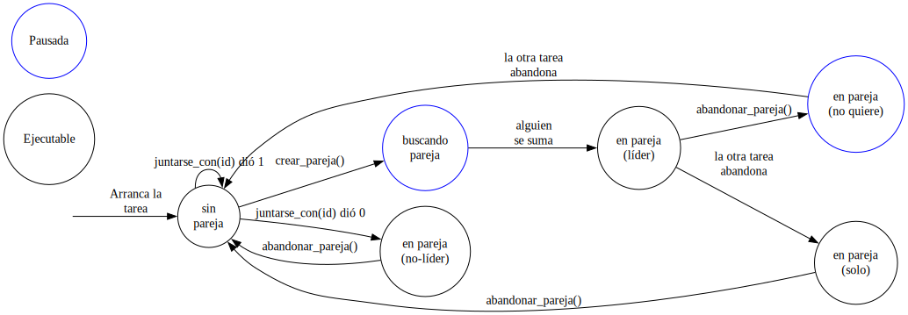

# Recuperatorio 2do Parcial de Arquitectura y Organización del Computador

## Normas generales

 - El parcial es INDIVIDUAL
 - Pueden disponer de la bibliografía de la materia y acceder al repositorio de código del taller de system programming, desarrollado durante la cursada
 - Pueden acceder a internet para buscar información, pero no está permitida la interacción con chat bots (ni chats con personas). Pueden usar Google para acceder al material de referencia, pero para consultas esperamos que utilicen otro buscador (Duckduckgo con assist apagado, por ejemplo) ya que las respuestas automáticas con IA de Google se encuentran comprendidas en las restricciones indicadas.
 - Las resoluciones que incluyan código, pueden usar assembly o C. No es necesario que el código compile correctamente, pero debe tener un nivel de detalle adecuado para lo pedido por el ejercicio.

## Régimen de Aprobación

En este parcial se evalúa el manejo de los mecanismos de:
- Manejo de memoria mediante Segmentación y Paginación
- Excepciones, interrupciones de hardware y syscalls mediante Interrupciones al procesador
- Permisos y cambios de nivel de privilegio
- Administración del tiempo de procesamiento y del espacio de memoria para la ejecución de tareas.

Para la Arquitectura Intel x86.
Cualquier **error de concepto grave** sobre el funcionamiento de estos mecanismos calificará la entrega como insuficiente. Es decir, la entrega debe demostrar, en la medida exigida por el enunciado, comprensión clara de la mayoría estos mecanismos, e incomprensión de ninguno.

**NOTA: Lea el enunciado del parcial hasta el final, antes de comenzar a resolverlo.**

## Régimen de Promoción (solo para quienes estén rindiendo por primera vez con ausencia justificada a la primer fecha)

Quien demuestre comprensión clara de **todos** los temas, en la medida exigida por el enunciado, y conteste correctamente las preguntas teóricas encontradas al final de este enunciado, podrá acceder al régimen de promoción. Esto es válido únicamente para la primer instancia del parcial y no para su recuperatorio.

## Modalidad de Entrega

> [!WARNING]
> Se estará circulando por el aula una planilla escrita donde **deben** anotarse para que tengamos constancia de que su presencia en los laboratorios al momento del parcial.
> De no anotarse no podremos considerar su entrega como válida. La planilla, luego de circular, se encontrará en los escritorios al frente de cada laboratorio. **No se vayan sin anotarse!**

Deberán crear una nueva branch en este repositorio y allí desarrollar su solución en el archivo `Resolucion.md`, en formato Markdown (Acá tienen un [machete](https://github.com/adam-p/markdown-here/wiki/markdown-cheatsheet) de cómo dar formato en markdown). Es importante que no utilicen otro formato ya que dificultaría la corrección. 
Si su solución utiliza código modificado del Trabajo Práctico, es importante que lo incluyan además de explicar en palabras las modificaciones (pueden copiar y pegar cualquier cosa de sus repositorios de TP). También pueden incluir imágenes si así lo desean.
Una vez finalizado, completarán la entrega creando un Pull Request e incluyendo a ayoc-bot como reviewer.

## Contexto
Como muchas actividades son mas divertidas de hacer en parejas, como bailar un tango o jugar al truco, se pensó que las tareas podrían trabajar en conjunto para poder solucionar problemas de forma cooperativa.
Nuestro sistema implementará una nueva funcionalidad llamada _parejas_ con las siguientes características:
- Toda tarea puede pertenecer **como máximo** a una pareja.
- Toda tarea puede _abandonar_ a su pareja.
- Las tareas pueden formar parejas cuantas veces quieran, pero solo pueden pertenecer a una en un momento dado.
- Las tareas de una pareja comparten un area de memoria de 4MB ($2^{22}$ bytes) a partir de la direccion virtual `0xC0C00000`. Esta región se asignará bajo demanda. Acceder a memoria no asignada dentro de la región reservará sólo las páginas necesarias para cumplir ese acceso. Al asignarse memoria ésta estará limpia (todos ceros). **Los accesos de ambas tareas de una pareja en ésta región deben siempre observar la misma memoria física.**
- Sólo la tarea que **crea** una pareja puede **escribir** en los 4MB a partir de `0xC0C00000`.
- Cuando una tarea abandona su pareja pierde acceso a los 4MB a partir de `0xC0C00000`.

## Primer ejercicio
Para poder soportar el mecanismo de _parejas_, el sistema debe implementar las tres syscalls que serán detalladas a continuación.

### `crear_pareja()`
Para crear una pareja una tarea deberá invocar `crear_pareja()`. Como resultado de esto se deben cumplir las siguientes condiciones:
- Si **ya pertenece a una pareja** el sistema ignora la solicitud y retorna de inmediato.
- Sino, la tarea no volverá a ser ejecutada hasta que otra tarea se una a la pareja.
- La tarea que crea la pareja será llamada la **líder** de la misma y será la única que puede escribir en el área de memoria especificado.

La firma de la syscall es la siguiente:
```C
void crear_pareja();
```

### `juntarse_con(id_tarea)`
Para unirse a una pareja una tarea deberá invocar `juntarse_con(<líder-de-la-pareja>)`. Aquí se deben considerar las siguientes situaciones:
- Si **ya pertenece a una pareja** el sistema ignora la solicitud y retorna `1` de inmediato.
- Si la tarea identificada por `id_tarea` no estaba **creando** una pareja entonces el sistema ignora la solicitud y retorna `1` de inmediato.
- Si no, se conforma una pareja en la que `id_tarea` es **líder**. Luego de conformarse la pareja, esta llamada retorna `0`.

La firma de la syscall es la siguiente:
```C
int juntarse_con(int id_tarea);
```

Notar que una vez **creada** la pareja se debe garantizar que ambas tareas tengan acceso a los 4MB a partir de `0xC0C00000` a medida que lo requieran.
Sólo la líder podrá escribir y **ambas podrán leer**.

### `abandonar_pareja()`
Para abandonar una pareja una tarea deberá invocar `abandonar_pareja()`, hay tres casos posibles a los que el sistema debe responder:
- Si la tarea no pertenece a ninguna pareja: No pasa nada.
- Si la tarea pertenece a una pareja y **no es su líder**: La tarea abandona la pareja, por lo que pierde acceso al área de memoria especificada.
- Si la tarea pertenece a una pareja y **es su líder**: La tarea queda bloqueada hasta que la otra parte de la pareja abandone. Luego pierde acceso a al área de memoria especificada.

La firma de la syscall es la siguiente:
```C
void abandonar_pareja();
```

### Condiciones generales
1. Se debe definir el mecanismo por el cual las syscall `crear_pareja`, `juntarse_con` y `abandonar_pareja` recibirán sus parámetros y retornarán sus resultados según corresponda.
2. Se debe dar una implementación para cada una de las syscalls. Explicitar las modificaciones al kernel que sea necesario realizar, como pueden ser estructuras o funciones auxiliares.

A modo de ayuda el siguiente es un diagrama de estados en el que se puede ver todas las posibles circunstancias en las que una tarea puede encontrarse. Se omiten las transiciones en las que no se hace nada (una tarea sin pareja intenta abandonar a su pareja ó una tarea con pareja intenta crear otra pareja).


## Segundo ejercicio

Escribir la función `uso_de_memoria_de_las_parejas`, la cual permite averiguar cuánta memoria está siendo utilizada por el sistema de parejas.
Ésta función debe ser implementada por medio de código ó pseudocódigo que corra en nivel 0.

La firma esperada de la función es la siguiente:
```c
uint32_t uso_de_memoria_de_las_parejas();
```

Tengan en consideración los siguientes puntos:
- Cuando `abandonar_pareja` deja a una pareja sin participantes los recursos asociados cuentan como liberados.
- Una pareja sólo usa la memoria a la que intentó acceder, no se contabiliza toda la memoria a la que podría acceder en el futuro.
- Una página _es usada por el sistema de parejas_ si es accesible dentro de la región compartida para parejas por alguna de las tareas que actualmente se encuentran en pareja (o son líderes solitarios de una pareja que aún no se terminó de disolver).
- En el caso en que ambas tareas de una pareja utilizan, por ejemplo, el primer megabyte del área compartida de su pareja, la función debe retornar que hay **un megabyte** de memoria en uso por el sistema de parejas. Es decir, no se debe contabilizar dos veces el mismo espacio de memoria si ambas tareas de la pareja lo están utilizando.

## A tener en cuenta para la entrega
- Se parte de un sistema igual al del TP-SP terminado, sin ninguna funcionalidad adicional.
- Indicar todas las estructuras de sistema que deben ser modificadas para implementar las soluciones.
- Está permitido utilizar las funciones desarrolladas en las guías y TPs, siempre y cuando no utilicen recursos con los que el sistema no cuenta.
- Es necesario que se incluya una **explicación con sus palabras** de la idea general de las soluciones.
- Es necesario explicitar todas las asunciones que hagan sobre el sistema.
- Es necesaria la entrega de **código que implemente las soluciones**.
- `zero_page()` modifica páginas basándose en una **dirección virtual** (no física!)

## Preguntas teóricas
Las siguientes preguntas se corrigen aparte. Por favor, entregar sus respuestas en el archivo `RtasTeoricas.md`. Antes de responderlas revisar la sección `Régimen de Promoción`.

1. Explica detalladamente como funciona el handshake de "Interrupt Acknowledge" entre el procesador x86 y los PIC 8259. Detallar como obtiene el procesador el tipo de cada interrupcion, y quien lo provee en cada caso.
2. Un procesador genera la siguiente dirección lineal: `0x8BC170FC`. Por los pines de Address sale el número `0x324E70FC`. Se pide:
    1. Calcular el contenido del descriptor de la página de 4K de memoria física.
    2. Calcular el número de ese descriptor dentro de tabla de páginas.
    3. Calcular el número de descriptor de la página de memoria física que contiene la Tabla de Página en donde está el descriptor de la página de 4K direccionada.
    4. Sabiendo que la estructura de tablas de páginas se ha diseñado a partir de la dirección `0x8000` (en donde está el DTP), y que las Tablas de Páginas se ponen a continuación ordenadas de acuerdo con el número de su descriptor en la DTP calcular:
        1. El contenido del descriptor de la página que contiene la tabla de páginas en donde está el descriptor citado en (i)
        2. El contenido de CR3. Graficar el sistema de paginación con los resultados calculados indicando el proceso de traducción completo.
