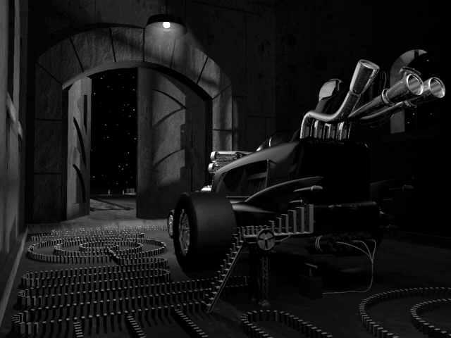
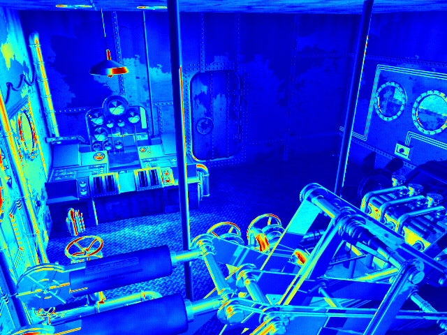
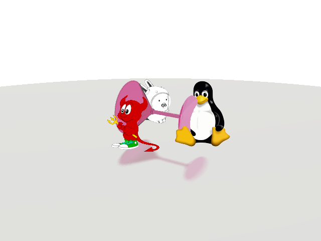
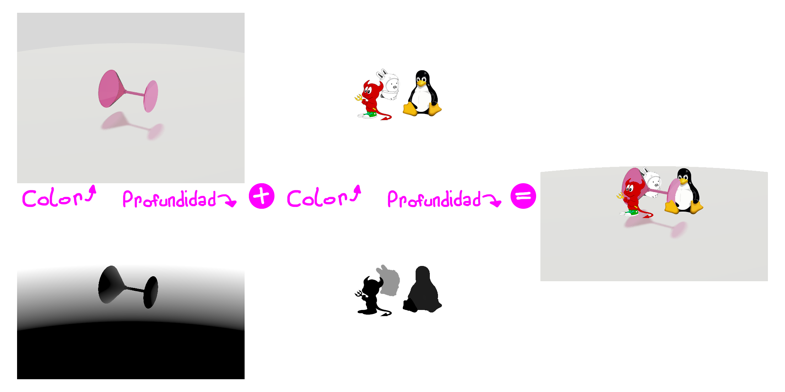
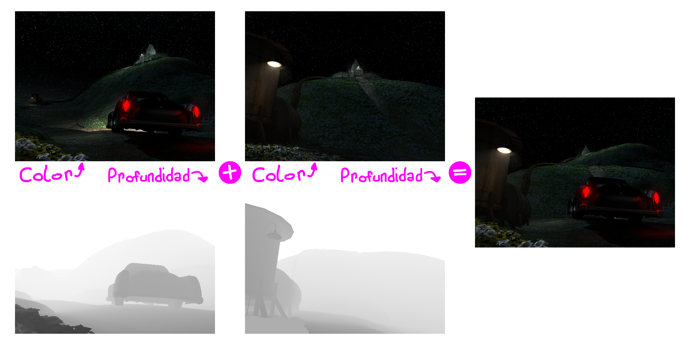
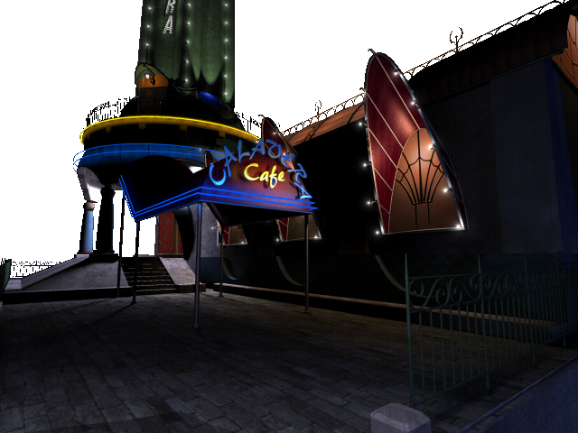

# SIMD
Arquitectura y Organización del Computador

**Entrega:** 22/05/2025 (29/05/2025 para quienes rindan recuperatorio en la primer fecha)

**Reentrega:** 05/06/2025 (12/06/2025 para quienes rindan recuperatorio en la primer fecha)

-----------

Este trabajo práctico consiste en implementar filtros gráficos
utilizando el modelo de procesamiento SIMD.  Aplicaremos lo estudiado en
clase y lo practicado previamente programando de manera vectorizada un conjunto
de filtros para imágenes.

Se espera que los ejercicios se resuelvan haciendo uso del paradigma SIMD,
procesando **múltiples datos simultáneamente** siempre que sea posible.

# Compilación y Testeo

Para compilar y ejecutar los tests se dispone de un archivo
`Makefile` con los siguientes *targets*:

| Comando             | Descripción                                                         |
| ------------------- | ------------------------------------------------------------------- |
| `make test_c`       | Genera el ejecutable usando la implementación en C del ejercicio.   |
| `make test_asm`     | Genera el ejecutable usando la implementación en ASM del ejercicio. |
| `make run_c`        | Corre los tests usando la implementación en C.                      |
| `make run_asm`      | Corre los tests usando la implementación en ASM.                    |
| `make valgrind_c`   | Corre los tests en valgrind usando la implementación en C.          |
| `make valgrind_asm` | Corre los tests en valgrind usando la implementación en ASM.        |
| `make clean`        | Borra todo archivo generado por el `Makefile`.                      |

Además, tener en cuenta lo siguiente:

- Es importante que lean la documentación provista en el archivo header
  correspondiente (`ej1.h`, `ej2.h` o `ej3.h` según corresponda). La
  documentación completa de las funciones se encuentra en dichos headers, no en
  el presente enunciado.
- Todos los incisos son independientes entre sí.
- El sistema de tests de este trabajo práctico **sólo correrá los tests que
  hayan marcado como hechos**. Para esto deben modificar la variable
  `EJERCICIO_xx_HECHO` correspondiente asignándole `true` (en C) ó `TRUE` (en
  ASM). `xx` es el inciso en cuestión: `1`, `2`, `3A` o `3B`.

# Formatos de píxel

A lo largo de este TP vamos a usar varios formatos distintos de píxel.  En esta
sección se documentan las estructuras que vamos a tratar.  Sumado a esto
también se pueden leer las definiciones de `common.h`.

## Color (`rgba_t`)

Nuestras imágenes a color tienen 8 bits por canal (0 a 255) con 4 canales: Rojo
(R), Verde (G), Azul (B), Alfa (A). Cuando un canal vale 0 la intensidad del
mismo es la mínima mientras que 255 es la intensidad máxima.

```c
typedef struct rgba_pixfmt {
	uint8_t r;
	uint8_t g;
	uint8_t b;
	uint8_t a;
} rgba_t;
```

**Campos:**
- `r`: La cantidad de rojo en el píxel. Va de 0 a 255.
- `g`: La cantidad de verde en el píxel. Va de 0 a 255.
- `b`: La cantidad de azul en el píxel. Va de 0 a 255.
- `a`: La transparencia del píxel. Va de 0 a 255.

## Escala de grises 8bits (`uint8_t`)

Las imágenes en escala de grises tendrán un único canal (cuánta _"luz"_ hay en
ese píxel) de 8 bits. En lugar de tener una representación específica para ese
tipo de dato usaremos `uint8_t`.

## Mapa de profundidad 32bits (`int32_t`)

Los mapas de profundidad del ejercicio 3 tendrán un único canal de 32 bits.
Este canal es signado y usaremos `int32_t` como tipo de dato para estos
_"píxeles"_.

# Ejercicio 1 - Blanco y Negro

Un videojuego que hace uso de una estética _noir_ posee muchas escenas en
escala de grises. En lugar de tener versiones _a color_ y versiones _blanco y
negro_ de todas las texturas se decidió hacer la transformación a escala de
grises como un efecto de postprocesamiento.  Dado el requisito de mantener
60FPS incluso en computadoras poco potentes se quiere acelerar este efecto
utilizando SIMD.



La forma más inocente de pasar una imagen a escala de grises sería promediar el
valor de cada uno de los canales ($`\frac{R + G + B}{3}`$), el problema con
esto es que no todos los colores nos resultan igual de brillantes. Entonces
debemos ponderar nuestra suma de acuerdo a la _"luminosidad"_ que aporta cada
color.  Pese a esta complejidad la fórmula para convertir colores a escala de
grises resulta bastante sencilla:
```math
\text{Luminosidad} = 0.2126 * \text{Rojo} + 0.7152 * \text{Verde} + 0.0722 * \text{Azul}
```

En este primer filtro la imagen resultante usa formato RGBA por lo que el píxel
destino será:
```math
\begin{aligned}
\text{Rojo}_{\text{Salida}}  &= \text{Luminosidad} \\
\text{Verde}_{\text{Salida}} &= \text{Luminosidad} \\
\text{Azul}_{\text{Salida}}  &= \text{Luminosidad} \\
\text{Alfa}_{\text{Salida}}  &= 255
\end{aligned}
```

## Función a implementar
```c
void ej1(
	rgba_t* dst,
	rgba_t* src,
	uint32_t width, uint32_t height
);
```

**Parámetros:**
- `dst`: La imagen destino. Está a color (RGBA) en 8 bits sin signo por canal.
- `src`: La imagen origen A. Está a color (RGBA) en 8 bits sin signo por canal.
- `width`:  El ancho en píxeles de `src` y `dst`.
- `height`: El alto en píxeles de `src` y `dst`.

# Ejercicio 2 - Mapa de calor

Además de escenas imitando el cine de los años 30, el juego posee una subtrama
sobre espionaje internacional inspirada en la guerra fría. Uno de los _gadgets_
principales es un visor térmico, pero implementar un mapa de calor sobre cada
personaje y objeto en el juego es demasiado costoso. En su lugar, una búsqueda
furiosa por internet dió con un filtro que se parece lo suficiente a los
resultados que se buscan. Nuevamente el requisito _real-time_ genera la
necesidad de acelerar este filtro utilizando SIMD.



Para calcular el mapa de calor lo primero que hay que hacer es computar la
"temperatura" del pixel en cuestión:
```math
\text{Temperatura} = \frac{\text{Rojo} + \text{Verde} + \text{Azul}}{3}
```

En base a la temperatura eligiremos un color, pasando de azul a verde y de
verde a rojo. Cada canal del resultado tiene la siguiente evolución al cambiar
la temperatura:
```
|          ____________________
|         /                    \
|        /                      \        Y = intensidad
| ______/                        \______
|
+---------------------------------------
             X = temperatura
```

Para calcular esta función se utiliza la siguiente expresión:
```math
f(x) = \text{min}(255, \text{max}(0, 384 - 4|x - 192|))
```

Cada canal calcula $`f(t)`$ para un $`t`$ distinto. Coordinar estos
corrimientos es lo que hace que el azul comience a bajar cuando el verde llega
a tope (lo mismo ocurre con el verde y el rojo).

Teniendo todo esto en mente los píxeles resultantes son:
```math
\begin{aligned}
\text{Temperatura}           &= \frac{\text{Rojo} + \text{Verde} + \text{Azul}}{3} \\
\text{Rojo}_{\text{Salida}}  &= f(\text{Temperatura})       \\
\text{Verde}_{\text{Salida}} &= f(\text{Temperatura} + 64)  \\
\text{Azul}_{\text{Salida}}  &= f(\text{Temperatura} + 128) \\
\text{Alfa}_{\text{Salida}}  &= 255
\end{aligned}
```

## Función a implementar
```c
void ej2(
	rgba_t* dst,
	rgba_t* src,
	uint32_t width, uint32_t height
);
```

**Parámetros:**
- `dst`: La imagen destino. Está a color (RGBA) en 8 bits sin signo por canal.
- `src`: La imagen origen A. Está a color (RGBA) en 8 bits sin signo por canal.
- `width`:  El ancho en píxeles de `src` y `dst`.
- `height`: El alto en píxeles de `src` y `dst`.

# Ejercicio 3 - Profundidad

Las escenas que se quieren mostrar en nuestro videojuego son mucho más
complejas de lo que el hardware actual puede renderizar en tiempo real. Para
obtener buena fidelidad gráfica se decidió pre-renderizar contenido 3D más
detallado y _superponer_ los personajes sobre el mismo. El pequeño problema de
esto es que un personaje podría estar delante de una montaña pero detrás de un
árbol. Es decir, sus píxeles sólo deben ser mostrados si se encuentran **más
cerca** de la cámara que los del contenido prerenderizado.




Hacer esto es relativamente fácil. Se toman dos imágenes de las cuales se tiene
su mapa de color (4 canales, RGBA, 8 bits por canal, sin signo) y su mapa de
profundidad (1 canal, escala de grises, 8 bits por canal, sin signo). Por cada
píxel en las imágenes fuente se elije el de **menor profundidad** y se escribe
en la imagen destino.  Es decir:
```math
\texttt{dst}[y, x] =
\begin{cases}
    \texttt{a}[y, x] & \text{si} \  \texttt{depth\_a}[y, x] < \texttt{depth\_b}[y, x] \\
    \texttt{b}[y, x] & \text{sino}
\end{cases}
```





Algunos programas miden el mapa de profundidad en metros mientras que otros en
pies, yardas o centímetros. Por esto, cada mapa tiene también dos factores de
corrección: `scale` y `offset`. El mapa de profundidad corregido usa enteros de
32 bits con signo para evitar posibles overflows. Es decir, el mapa de
profundidad corregido es (1 canal, escala de grises, 32 bits, con signo). La
forma en la que se aplica la corrección es:
```math
\texttt{dst\_depth}[y, x] = \texttt{scale} \times \texttt{uint8\_to\_int32}(\texttt{src\_depth}[y, x]) + \texttt{offset}
```

Es importante escribir el alfa correcto dado que esto permite además utilizar
el efecto para _recortar_ partes deseables de una imagen:



Finalmente, dado que esta es la forma principal de presentar imágenes en
nuestro videojuego es nuevamente necesario acelerar el efecto utlizando SIMD.
Por encima de esto el objetivo es procesar de a 4 pixeles simultáneamente.

## Ejercicio 3A - Ajustar el mapa de profundidad

Primero deben implementar el algoritmo de corrección. El mismo realiza tanto la
conversión de 8 bits sin signo a 32 bits con signo como la aplicación de la
transformación lineal especificada por `scale` y `offset`. La corrección es
básicamente hacer
$`\texttt{dst\_depth}[y, x] = \texttt{scale} \times \texttt{src\_depth}[y, x] + \texttt{offset}`$
por cada píxel de `dst`.

### Función a implementar
```c
void ej3a(
	int32_t* dst_depth,
	uint8_t* src_depth,
	int32_t scale, int32_t offset,
	uint32_t width, uint32_t height
);
```

**Parámetros:**
- `dst_depth`: La imagen destino (mapa de profundidad). Está en escala de
  grises a 32 bits con signo por canal.
- `src_depth`: La imagen origen (mapa de profundidad). Está en escala de grises
  a 8 bits sin signo por canal.
- `scale`: El factor de escala. Es un entero con signo de 32 bits. Multiplica a
  cada pixel de la entrada.
- `offset`: El factor de corrimiento. Es un entero con signo de 32 bits. Se
  suma a todos los píxeles luego de escalarlos.
- `width`: El ancho en píxeles de `src_depth` y `dst_depth`.
- `height`: El alto en píxeles de `src_depth` y `dst_depth`.

## Ejercicio 3B - Aplicar el mapa de profundidad

Luego sigue implementar el algoritmo de *"mezclado sensible a la profundidad"*.
De forma breve este algoritmo se puede describir como hacer $`
\texttt{dst}[y, x] =
\begin{cases}
    \texttt{a}[y, x] & \text{si} \  \texttt{depth\_a}[y, x] < \texttt{depth\_b}[y, x] \\
    \texttt{b}[y, x] & \text{sino}
\end{cases}
`$ en cada píxel de `dst`. En caso de empate entre las profundidades de A y B
se debe escribir el píxel de B. La entrada son dos imágenes (`a` y `b`) en
conjunto con sus mapas de profundidad.

### Función a implementar
```c
void ej3b(
	rgba_t* dst,
	rgba_t* a, int32_t* depth_a,
	rgba_t* b, int32_t* depth_b,
	uint32_t width, uint32_t height
);
```

**Parámetros:**
- `dst`: La imagen destino. Está a color (RGBA) en 8 bits sin signo por canal.
- `a`: La imagen origen A. Está a color (RGBA) en 8 bits sin signo por canal.
- `depth_a`: El mapa de profundidad de A. Está en escala de grises a 32 bits
  con signo por canal.
- `b`: La imagen origen B. Está a color (RGBA) en 8 bits sin signo por canal.
- `depth_b`: El mapa de profundidad de B. Está en escala de grises a 32 bits
  con signo por canal.
- `width`: El ancho en píxeles de todas las imágenes parámetro.
- `height`: El alto en píxeles de todas las imágenes parámetro.

# Condiciones que se puede asumir
- Tanto el ancho como el alto de las imágenes (en píxeles) es múltiplo de 16
- $`\text{scale} \times \text{profundidad} + \text{offset}`$ es siempre
  representable como entero de 32 bits con signo.
- Las imágenes tienen el mismo mismo ancho y alto (en píxeles) que sus mapas de
  profundidad.
- Las imágenes a mezclar tienen el mismo ancho y alto (en píxeles).

# Condiciones de aprobación

Para que una entrega pueda considerarse correcta debe cumplir los siguientes
requisitos:
- Tener implementados los ejercicios 1, 2, 3A y 3B en ASM. Las implementaciones
  en C son opcionales.
- Las implementaciones deben pasar los tests proporcionados sin fallos. Los
  ejercicios 1 y 2 tienen una tolerancia de ± 1.
- Las implementaciones no deben presentar errores de memoria detectables por
  valgrind. Es decir, `make valgrind_asm` debe terminar sin encontrar errores
  de memoria.
- La implementación de **al menos uno** de los primeros dos ejercicios debe
  procesar de a cuatro píxeles en simultáneo. _"Simultáneo"_ no refiere a la
  cantidad de bytes leídos y escritos por iteración del ciclo principal sino a
  la estructura de la solución en sí.
- La implementación de los ejercicios 3A y 3B debe procesar de a cuatro píxeles
  en simultáneo.
- El trabajo es **individual**. Utilizaremos herramientas que detectan plagio en código para asegurar la originalidad de la entrega.

# Recomendaciones

- Realizar las implementaciones en C de los ejercicios propuestos. Usarlas para
  comparar resultados con las implementaciones en ASM.
- Comentar el código de forma detallada, agregando diagramas del estado de los
  registros en caso de considerarlo necesario.
- Realizar implementaciones en ASM que procesen de a un píxel para los
  ejercicios 1 y 2. Buscar una versión _más paralela_ de éstos **luego** de
  tenerlos funcionando.
- Utilizar `gdb` para asegurarse que partes específicas del código funcionan
  como es esperado (por ejemplo: un `pshufb`).
- El equivalente a _print debugging_ de la computación gráfica es marcar los
  píxeles en dónde cierta condición es cierta con algún color específico.
- Implementar partes del filtro en C es mucho más fácil que implementarlas en
  ASM. Una forma de asegurarse que algún cálculo de un filtro está bien hecho
  es implementar un filtro en C y ASM dónde la imagen resultante represente el
  resultado de ese cálculo (por ejemplo: calcular temperatura). Si las imágenes
  generadas resultan equivalentes la implementación en ASM muy probablemente
  sea correcta.
