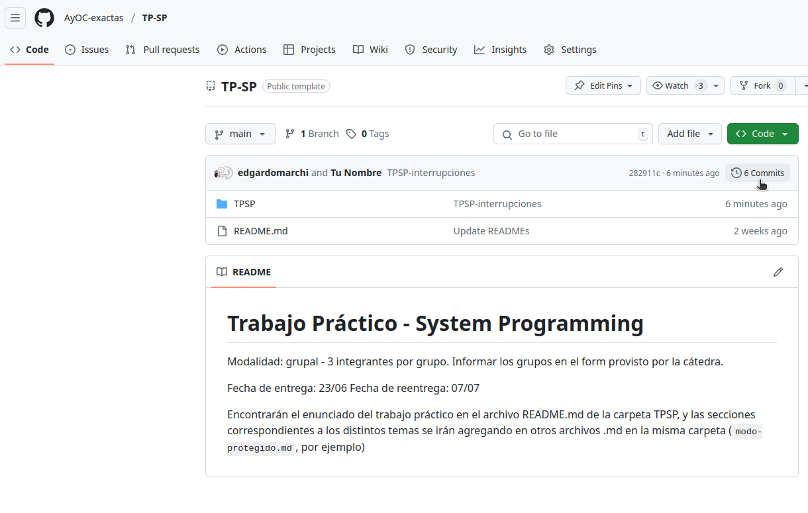
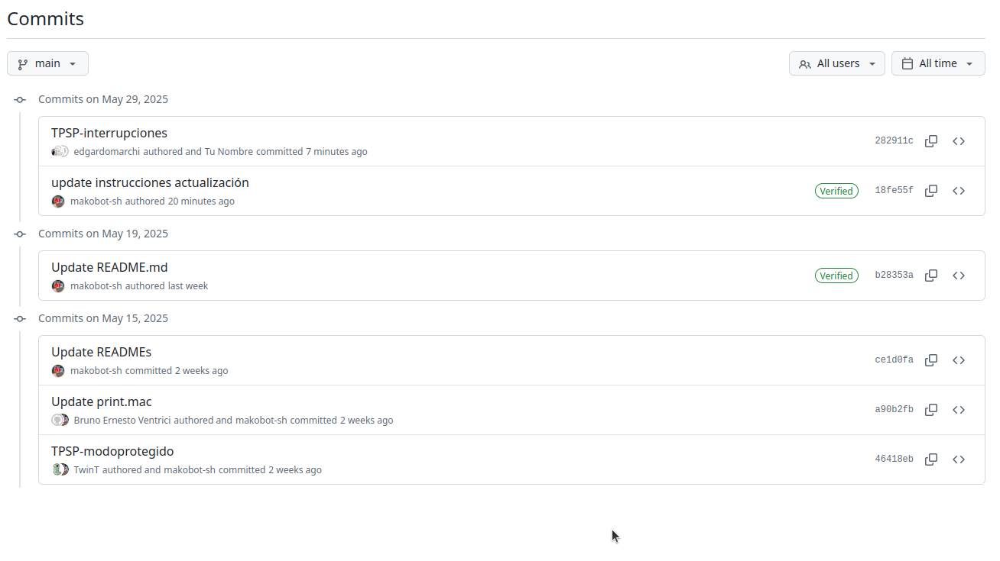

# Trabajo Práctico de System Programming

Arquitectura y Organización del Computador

## Partes

- [Parte 1: Pasaje a modo protegido](modo-protegido.md)
- [Parte 2: Interrupciones](interrupciones.md)
- [Parte 3: Paginación](paginacion.md)
- [Parte 4: Tareas](tareas.md)

## Introducción

Durante la actual y las próximas clases, vamos a adentrarnos al mundo de
System Programming. Como hemos visto en la teórica, al arrancar una
computadora, hay una serie de tareas que realiza el sistema operativo
que tienen como objetivo crear un entorno controlado y seguro donde
ejecutar programas y arbitrar el acceso a los recursos.

El trabajo va a ser incremental a lo largo de varias clases prácticas.
Vamos a crear un único software en modo 32 bits desde hoy a fin de
cuatrimestre. Por lo tanto, cada encuentro va a tener el mismo conjunto
de archivos y código al cual se le van a ir agregando más código y
nuevos archivos.

Clase a clase, vamos a trabajar una perspectiva o parte diferente del
sistema.

## El manual

Intel nos ofrece documentación para que podamos llevar a cabo la tarea
antes descripta. A partir de ahora, vamos a utilizar también el manual:

[*Intel® 64 and IA-32 Architectures Software Developer's Manual Volume 3
(3A, 3B, 3C & 3D):System Programming
Guide*](https://software.intel.com/content/dam/develop/external/us/en/documents-tps/325384-sdm-vol-3abcd.pdf)

Adicionalmente, van a tener que consultar los manuales que vimos en la
primeras clases:

[*Intel® 64 and IA-32 Architectures Software Developer\'s Manual Volume
1: Basic
Architecture*](https://software.intel.com/content/dam/develop/external/us/en/documents-tps/253665-sdm-vol-1.pdf)

[*Intel® 64 and IA-32 Architectures Software Developer\'s Manual Volume
2: Instruction Set Reference,
A-Z*](https://software.intel.com/content/dam/develop/external/us/en/documents-tps/325383-sdm-vol-2abcd.pdf)

## QEMU

Vamos a utilizar como entorno de pruebas el programa QEMU. Este nos
permite simular el arranque de una computadora IBM-PC compatible.

Como vimos en las clases teóricas, al inicio, una computadora comienza
con la ejecución del POST y del BIOS. El BIOS se encarga de reconocer el
primer dispositivo de booteo. En nuestro taller, vamos a utilizar como
dispositivo un Floppy Disk (el disquete en lugar del disco rígido como
suele ser comúnmente). Para eso, vamos a utilizar una imagen Floppy Disk
virtual en QEMU como dispositivo de booteo. En el primer sector del
floppy, se almacena el boot-sector (sector de arranque). El BIOS se
encarga de copiar a memoria 512 bytes del sector de booteo, y dejarlo a
partir de la dirección `0x7C00`. Luego, se comienza a ejecutar el código a
partir de esta dirección. El boot-sector debe encontrar en el floppy el
archivo `KERNEL.BIN` y copiarlo a memoria. Éste se copia a partir de la
dirección `0x1200`, y luego se ejecuta a partir de esa misma dirección.

Es importante tener en cuenta que el código del boot-sector se encarga
exclusivamente de copiar el kernel y dar el control al mismo, es decir,
no cambia el modo del procesador. Este código inicial viene dado en el
taller y nuestro trabajo, a partir de ahí, va a ser construir parte de
ese kernel de modo que a final de cuatrimestre, pueda ejecutar programas
y tareas sencillas.

## Preparación: actualizando su fork del repositorio grupal

Iremos agregando distintas partes al TP a medida que vayamos presentando los temas correspondientes. En general estas partes llegarán en forma de un **PR automáticamente abierto en su repositorio que deben aceptar**. Dejamos instrucciones de como hacerlo en la próxima sección. Puede ocurrir que dichos PRs fallen en crearse, en cuyo caso deben seguir las instrucciones de la sección `Actualizando su fork manualmente`. Es probable que si actualizan la branch main manualmente, la cátedra no pueda crearles más PRs automáticos para entregas siguientes. Solo tiene 4 partes el TP, así que esto no es grave.

### Actualizando su fork mediante el PR automático
Cada vez que haya una actualización de código les debería llegar un PR con la nueva versión de los archivos del trabajo práctico:


En el PR podrán verificar los archivos que estarán cambiando en su branch `main`, junto con los commits docentes asociados a dichos cambios. Basta con presionar `Merge pull request > Confirm Merge` para traer la nueva versión del enunciado a la branch `main`. No deberían estar trabajando en la branch `main`, por lo que estos merge siempre deberían poderse hacer sin conflicto. 


Una vez traidos los cambios a main, pueden seguir con las instrucciones de la sección `Trayendo los cambios a las branches de trabajo`.

### Actualizando su fork manualmente
> [!WARNING]
> Es MUY importante que hayan hecho `git push` de su trabajo y lo puedan ver en la UI web de github antes de avanzar con cualquiera de estas opciones. La cátedra no se responsabiliza por posibles pérdidas de trabajo de no seguir estas instrucciones. Cualquier duda, consulten en los labos o en discord.

Estas son las instrucciones para sincronizar manualmente su fork grupal con el taller de **system programming**. Pueden seguirlas en la branch `main` (en cuyo caso no les funcionarán más los PR automáticos) o en una branch nueva que parta desde main, llamemosla `main-update`.

1. Entrar a la página web del repositorio https://github.com/AyOC-exactas/TP-SP, y entrar a la sección de commit history de la branch main


Allí, tomar nota del commit hash de los cambios que queremos traer. Por ejemplo, en este caso, nos interesa traer el commit "TPSP-interrupciones" con hash 282911c. Podríamos tambien querer traer más de un commit, por ejemplo los commits b28353a y 18fe55f que contienen estas instrucciones de actualización: en ese caso tomamos nota de esos hash también, en orden de commit más viejo (b28353a) a más nuevo (282911c).


2. Agregar el repositorio de la cátedra como *upstream* remoto:
   - Si usaron https:
	```sh
	git remote add upstream https://github.com/AyOC-exactas/TP-SP.git
	```
   - Si usaron ssh:
	```sh
	git remote add upstream git@github.com:AyOC-exactas/TP-SP.git
	```
3. Traer el último estado del upstream
```sh
git fetch upstream
```
4. Moverse al branch donde quieran traer los cambios, se sincronizarán en dicha branch únicamente
```sh
git checkout <branch>
```
5. Traer del *upstream* cada uno de los commits nuevos, en orden de más viejo a más nuevo
```sh
git cherry-pick <commit-hash>
```
En el ejemplo anterior, correríamos `git cherry-pick b28353a`, luego `git cherry-pick 18fe55f` y finalmente `git cherry-pick 282911c`.


No deberían estar trabajando en la branch `main`, por lo que estos cherry-pick siempre deberían poderse hacer sin conflicto. Pero si al ejecutar el merge les aparece CONFLICT y dice que arreglen los conflictos para poder terminar el merge, deben:

1. Resolver los conflictos, ya sea con la herramienta de resolución de conflictos de VScode o a mano (se recomienda utilizar VScode).
2. Una vez resueltos los conflictos, tomar nota de cuales archivos tenían conflictos que fueron resueltos y ejecutar:
```sh
git add <archivos modificados>
git cherry-pick --continue
```
Y si todo salió bien,
```
git push origin
```

## Trayendo los cambios a las branches de trabajo (no `main`)
Cuando estén listos para avanzar con la siguiente parte del taller, tienen dos opciones. Antes de hacer cualquiera de las dos **deben** pararse en la branch donde estuvieron trabajando en la solución de la parte anterior y pushear todos sus cambios actuales mediante `git push`.

> [!WARNING]
> Es MUY importante que hayan hecho `git push` de su trabajo y lo puedan ver en la UI web de github antes de avanzar con cualquiera de estas opciones. La cátedra no se responsabiliza por posibles pérdidas de trabajo de no seguir estas instrucciones. Cualquier duda, consulten en los labos o en discord.

Opciones:
1. Pararse en la branch con su trabajo actual (`git switch <branch>`) y actualizarla con los nuevos contenidos mediante `git merge upstream/main`. 
2. Pararse en branch main (o main-update según corresponda), crear una branch nueva con `git checkout -b tp-parte-n` (donde tp-parte-n puede ser cualquier nombre de branch), y traer su trabajo previo desde la branch donde hayan trabajado anteriormente, ya sea copiando los cambios de forma manual o con `git cherry-pick` de todos los commits con cambios.
