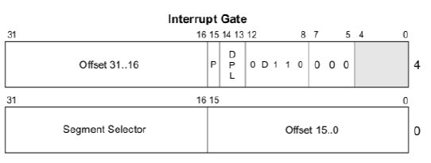
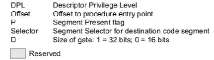

# System Programming: Interrupciones

En el punto anterior del TP, definimos la segmentación de la memoria, seteamos los valores iniciales de los registros de segmento, de los registros de la pila y mapeamos la pantalla a un segmento de video en memoria.
También, modificamos el bit menos significativo del registro CR0 para hacer el pasaje a modo protegido.

En este punto, vamos a definir la tabla de interrupciones (IDT - Interrupt Descriptor Table) para que nuestro procesador pueda atender adecuadamente las interrupciones que provengan del software, dispositivos externos y excepciones internas.

En particular, vamos a implementar dos importantes rutinas de atención de interrupción: la correspondiente al reloj y la del teclado, y dos _syscalls_ de nivel de usuarix que utilizaremos en futuras actividades.

## Archivos provistos

A continuación les pasamos la lista de archivos que forman parte del
taller de hoy junto con su descripción:

- `Makefile`: encargado de compilar y generar la imagen del _floppy disk_.

- `pic.c`, `pic.h`: funciones `pic_enable`, `pic_disable`, `pic_finish` y `pic_reset`.

- `isr.h`, `isr.asm`: rutinas de atención de interrupciones.

- `idt.h`, `idt.c`: definición de la tabla de interrupciones.

- `keyboard_input.h`, `keyboard_input.c`: funciones para procesar los datos leídos del controlador de teclado.

Los ejercicios que vamos a realizar hoy les van a pedir interpretar
código de estos archivos y escribir código únicamente en los archivos
`isr.h`, `isr.asm`, `idt.h`, `idt.c`, `pic.c`, `defines.h` y `kernel.asm`(éstos dos últimos los utilizaremos del taller anterior junto con el
resto de los archivos provistos para la actividad de "_pasaje a modo
protegido_"\... **no olvidar las clausulas `#include` donde sea
necesario!**).

## Ejercicios

### Primera parte: Definiendo la IDT

En esta parte, vamos a definir y cargar la IDT en memoria. Utilizaremos
los descriptores de excepciones, interrupciones y system calls. Además,
vamos a trabajar en las rutinas de atención de interrupción (*ISR:
Interrupt Service Routine*), en particular, las necesarias para atender
las excepciones. Estas rutinas, en principio, sólo van a imprimir en
pantalla la excepción generada, junto con el estado de los registros del
microprocesador.

Completen en grupo los siguientes puntos:

1. En el archivo idt.h, pueden encontrar la IDT definida como un arreglo de `idt_entry_t` declarado sólo una vez como `idt`.
El descriptor de la IDT en el código se llama `IDT_DESC`.

En el archivo idt.c pueden encontrar la definición de cada una de las entradas y la definición de la función `idt_init` que inicializa la IDT definiendo cada una de sus entradas usando la macro `IDT_ENTRYx`.

a) :pen_fountain: Observen que la macro `IDT_ENTRY0` corresponde a cada entrada de la IDT de nivel 0 ¿A qué se refiere cada campo? ¿Qué valores toma el campo offset?

Pueden ayudarse de la siguiente figura.
Observen que los atributos son los bits 15 a 5 de la palabra de 32 bits superior.

> Figura 1: Entrada de la IDT - Interrupt Gate

b) :pen_fountain: Completar los campos de Selector de Segmento (`segsel`) y los atributos (`attr`) de manera que al usarse la macro defina una *Interrupt Gate* de nivel 0.
Para el Selector de Segmento, recuerden que la rutina de atención de interrupción es un código que corre en el nivel del kernel. ¿Cuál sería un selector de segmento apropiado acorde a los índices definidos en la `GDT[segsel]`? ¿Y el valor de los atributos si usamos _Gate Size_ de 32 bits?

c) :pen_fountain: De manera similar, completar la macro `IDT_ENTRY3` para que defina interrupciones que puedan ser disparadas por código no privilegiado (nivel 3).

2. Completar la función idt_init() con las entradas correspondientes a las interrupciones de reloj y teclado ¿Qué macro utilizarían?

3. Nos queda definir dos system calls. Estas son interrupciones de software que se van a poder usar con nivel de privilegio de usuario, en nuestro caso, nivel 3.
Usar la macro correspondiente para definir system calls con número 88 y 98.

4. Completen `kernel.asm` inicializando la IDT y usen `lidt` para cargar la IDT en memoria

Compilen y ejecuten con qemu.
Pueden examinar la IDT con el comando `info idt` para ver toda la tabla o usar GDB tradicionalmente para ver una entrada: `p idt[x]` dónde `x` es el número de entrada en la IDT.

### Segunda parte: Rutinas de Atención de Interrupción

El manejo de las interrupciones lo estaremos haciendo en esta parte del
taller.

1. En `pic.c` deberan completar la inicialización del PIC (los PICs), en particular, la función pic_reset() deberá enviarles las palabras de configuración.
Recordar remapear las interrupciones del **PIC1** a partir de la 32 (0x20) y del **PIC2** a partir de la 40 (0x28).

2. Agregar en `kernel.asm` la inicialización correspondiente para los PICs.

3. Las rutinas de atención de interrupción son definidas en el archivo `isr.asm`.
Cada una está definida usando la etiqueta `_isr##` donde `##` es el número de la interrupción.
Busquen en el archivo la rutina de atención de interrupción del reloj.

Completar la rutina asociada al reloj, para que por cada interrupción llame a la función `next_clock`. La misma se encarga de mostrar, cada vez que se llame, la animación de un cursor rotando en la esquina inferior derecha de la pantalla.
La función `next_clock` está definida en `isr.asm`.

:pen_fountain: ¿Qué oficiaría de prólogo y epílogo de estas rutinas? ¿Qué marca el `iret` y por qué no usamos `ret`?

4. Completen la rutina de interrupción de teclado. La misma debe leer el scan code del puerto `0x60` y luego procesarlo con la función `process_scancode` provista en `keyboard_input.c`.

5. Escribir las rutinas asociadas a las interrupciones 88 y 98, para que modifique el valor de eax por 0x58 y 0x62 respectivamente.
Posteriormente, este comportamiento va a ser modificado para atender cada uno de los servicios del sistema.

6. Habiliten las interrupciones con `sti` en `kernel.asm`.
Luego, escriban un par de líneas que utilicen la instrucción `int` para probar alguna de las interrupciones de software que cargaron.
Pueden poner un breakpoint después de la interrupción para inspeccionar los registros y verificar que se produjo el cambio de valor en `eax`.

7. Compilen y ejecuten con qemu. Verifiquen la ejecución de la rutina de atención del reloj y de las interrupciones 88, 98.
Discutan por qué va rotando el reloj.

### Opcionales:  

1.  \[Optativo\] Vamos a trabajar con el reloj.
Vimos que es fundamental para la conmutación de tareas.
El mismo se puede configurar escribiendo el valor de la cuenta (16 bits) en el puerto 0x40.
La interrupción de reloj se genera, por defecto, cada 65536 pulsos de un clock de 1193182Hz (ciclos por segundo), es decir, llega la interrupción a una tasa de 1193812 Hz / 65536 = 18,206 Hz.

**Se pide:**

a. Escribir en el timer (puerto 0x40) el valor de cuenta para que las interrupciones lleguen al doble de velocidad.
Tener en cuenta que el bus es de 8 bits, por lo que se deben hacer 2 escrituras consecutivas (parte baja -- parte alta respectivamente).

b. :pen_fountain: ¿Cómo harían para que la impresión del caracter giratorio sea una vez por segundo?
