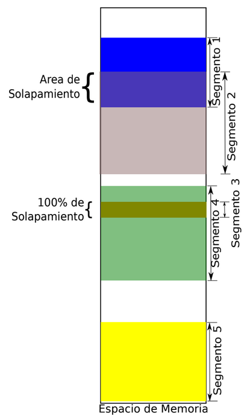
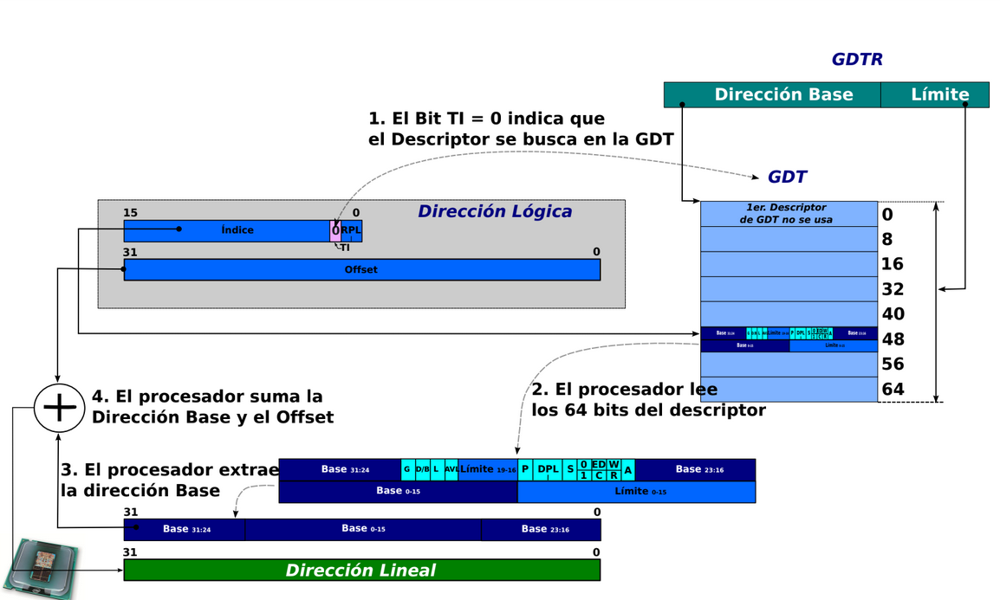

# System Programming: Pasaje a Modo Protegido

Los procesadores Intel x86, al arrancar, utilizan el modo real y por eso, debemos realizar una serie de configuraciones antes de pasar a modo protegido.

La memoria comienza como un arreglo continuo de bytes sin uso específico. Como programadores de sistema podemos segmentar dicha memoria asignándoles usos y privilegios particulares. Por ejemplo, podemos tener una sección para datos, otra para código, una sección con nivel de privilegio máximo y otras accesibles con privilegios de usuario. Estos privilegios diferenciados nos van a permitir proteger el código y los datos del sistema de ataques maliciosos de software o errores involuntarios que puedan dañar el funcionamiento del sistema.

Durante este taller, vamos a configurar los descriptores de segmentos
que realizan la segmentación de la memoria.



En la figura se ve un esquema de memoria segmentada. En el taller vamos a definir segmentos, pero usaremos un tipo de segmentación llamado ***flat***, que casi anula por completo el efecto de la unidad de segmentación. La unidad de paginación, que veremos más adelante, se encargará de proveer el esquema de protección necesario.

No es posible en x86 anular la unidad de segmentación. Por lo tanto, tenemos que definir los segmentos de alguna manera. Una vez definidos los segmentos, vamos a tener que escribir el código necesario para el pasaje a modo protegido.

## Archivos provistos

A continuación les pasamos la lista de archivos que forman parte del
taller de hoy junto con su descripción:

-   `Makefile` - encargado de compilar y generar la imagen del floppy disk.
-   `diskette.img.bz2` - la imagen del floppy que contiene el boot-sector preparado para cargar el kernel.
-   `kernel.asm` - esquema básico del código para el kernel.
-   `defines.h, colors.h` - constantes y definiciones.
-   `gdt.h, gdt.c` - definición de la tabla de descriptores globales.
-   `screen.h, screen.c` - rutinas para pintar la pantalla.
-   `a20.asm` - rutinas para habilitar y deshabilitar A20.
-   `print.mac` - macros útiles para imprimir por pantalla y transformar valores.
-   `kassert.h` - rutinas para garantizar invariantes en el kernel.
-   `i386.h` - funciones auxiliares para utilizar assembly desde C.
-   `types.h` - declaración de tipos comunes en el kernel.

Los ejercicios que vamos a realizar hoy les van a pedir interpretar código de estos archivos y escribir código únicamente en los archivos `kernel.asm`, `defines.h`, `screen.c` y `gdt.c`.

## Ejercicios

En estos ejercicios, vamos a dar nuestros primeros pasos en la programación de nuestro kernel. Cuando el bootloader termine su tarea, va a cargar la imagen binaria del kernel en una dirección de memoria y hará un salto a esa posición para empezar a ejecutar. Ahí es donde empieza nuestro trabajo. El punto de entrada de nuestro kernel se encuentra definido en `kernel.asm`.

Recuerden que el procesador arranca en modo real (16 bits). Nuestro programa tiene que completar la información mínima necesaria requerida por la documentación de Intel para poder pasar el procesador a modo protegido de 32 bits.

Por una serie de razones técnicas, el modelo de memoria segmentada no suele utilizarse en los sistemas operativos modernos. Intel no permite "apagar" la segmentación, pero sí es posible usar un modelo donde la segmentación es limitada al mínimo. Por esta razón, vamos a seguir el modelo "*Basic Flat Model*" para definir los segmentos. Pueden encontrarlo descrito en el Manual de Intel - *Volumen 3 - 3.2.1 Basic Flat Model.*

### Primera parte: Definiendo la GDT

Las preguntas a continuación las pueden responder inline o en otro archivo markdown. ¡Nada de pdfs o docx por favor!

1. Explorando el manual Intel *Volumen 3: System Programming. Sección 2.2 Modes of Operation*. ¿A qué nos referimos con modo real y con modo protegido en un procesador Intel? ¿Qué particularidades tiene cada modo?

2. Comenten en su equipo, ¿Por qué debemos hacer el pasaje de modo real a modo protegido? ¿No podríamos simplemente tener un sistema operativo en modo real? ¿Qué desventajas tendría?

Anteriormente, detallamos que la memoria es un arreglo continuo de bytes y que podemos segmentarla de acuerdo a tamaño, nivel de protección y uso. Debemos indicar al procesador la descripción de los segmentos, es decir, cómo están conformados los segmentos. Los ejercicios a continuación tienen que ver con el armado de la tabla de segmentos.

3. Busquen el manual *volumen 3 de Intel en la sección 3.4.5 Segment Descriptors*. ¿Qué es la GDT? ¿Cómo es el formato de un descriptor de segmento, bit a bit? Expliquen brevemente para qué sirven los campos *Limit*, *Base*, *G*, *P*, *DPL*, *S*. También pueden referirse a los slides de la clase teórica, aunque recomendamos que se acostumbren a consultar el manual.
    
4. La tabla de la sección 3.4.5.1 *Code- and Data-Segment Descriptor Types* del volumen 3 del manual del Intel nos permite completar el *Type*, los bits 11, 10, 9, 8. ¿Qué combinación de bits tendríamos que usar si queremos especificar un segmento para ejecución y lectura de código?



Hay dos tipos de tablas que describen segmentos a nivel global y local (GDT y LDT). La tabla LDT no se utiliza en el modelo de segmentación *flat* que estaremos utilizando. Para este taller sólo vamos a usar la Tabla de Descriptores Global (GDT). En esta tabla se definen los descriptores de segmento que le dan estructura a la memoria en el nivel de segmentación.

5. Inicialmente, vamos a definir los siguientes segmentos en la GDT:

    a.  Un segmento para código de nivel 0 ejecución/lectura

    b.  Un segmento para código de nivel 3 ejecución/lectura

    c.  Un segmento para datos de nivel 0 lectura/escritura

    d.  Un segmento para datos de nivel 3 lectura/escritura

Cada uno de estos segmentos deben direccionar los primeros 817 MiB[^1] de memoria y por estar usando segmentación *flat*, van a estar solapados. Escriban cómo quedarían los campos de cada descriptor de cada uno de los segmentos solicitados. Especifiquen el G, límite, la base, el tipo, P, DPL, S, P, AVL, L, D/B. Pueden completar con valores hexadecimales en la siguiente planilla: [*GDT Entradas*](https://docs.google.com/spreadsheets/d/1GczRjxYYt4jLSlZ5vJ7clHDZutnW1JJfl9pdL1wZI6w/edit?usp=sharing) (hacer una copia local para que no sea solo lectura).

Recuerden que el límite es el último valor accesible dentro del segmento (es inclusivo) y que el límite está relacionado con el nivel de granularidad **G** que hayan seleccionado.

> Noten que si bien definimos distintos niveles de privilegio, todos usan la misma región de memoria física, por lo cual, no hay una división real de permisos de accesos propuesto a nivel segmentación. Vamos a resolverlo en las próximas clases, cuando agreguemos paginación al kernel.
  
Ahora, trabajemos con el código provisto por la cátedra. Vamos a completar la tabla de segmentos y cargar los descriptores de segmento. Hemos provisto estructuras en C que permiten simplificar la especificación de los campos de cada descriptor.

6. En el archivo `gdt.h` observen las estructuras: `struct gdt_descriptor_t` y el `struct gdt_entry_t`. ¿Qué creen que contiene la variable `extern gdt_entry_t gdt;` y `extern gdt_descriptor_t GDT_DESC;`?

7. Buscar en el Volumen 3 del manual de Intel, sección 3.4.2 *Segment Selectors* el formato de los selectores de segmento. Observar en el archivo `defines.h` las constantes con los valores de distintos selectores de segmento posibles. Completen los defines faltantes en `defines.h` y entiendan la utilidad de las macros allí definidas. 
   **USAR LAS MACROS** para definir los campos de los entries de la gdt. En lo posible, no hardcodeen los números directamente en los campos.

8. En el archivo `gdt.c`, completen en el código la Tabla de Descriptores Globales (GDT) con los 4 segmentos definidos en el punto 5. (**usen, en la medida de lo posible, los defines del punto anterior**)

9. Ya está todo listo para cargar la GDT. Antes de eso, completen todo lo necesario en `kernel.asm` hasta "Habilitar A20" inclusive[^2]. Tengan en cuenta que las macros de impresión se encuentran definidas en `print.mac` y que para los colores hay constantes definidas en `colors.h`. Las macros reciben sus argumentos separados por comas, sin paréntesis ni nada. Por ejemplo:

    ```print_text_rm arg1, arg2, arg3, arg4, arg5.```

    *Hint*: investiguen para qué puede servir la instrucción **cli** en el manual 2.

10. Busquen qué hace la instrucción LGDT en el Volumen 2 del manual de Intel. Expliquen con sus palabras para qué sirve esta instrucción. En el código, ¿qué estructura indica donde está almacenada la dirección desde la cual se carga la GDT y su tamaño? ¿dónde se inicializa en el código?

11. Completen el archivo `kernel.asm` en la sección de cargar la GDT usando lo averiguado en el punto 8 para cargar la GDT.

12. Lean la guía de Qemu+gdb. Inserten un breakpoint luego de cargar la GDT. Podemos ahora comprobar el arranque de la máquina hasta ese punto. Para eso hay que compilar con `make` e iniciar `qemu`.

### Segunda parte: Pasaje a modo protegido

Para pasar a modo protegido tenemos que completar los siguientes pasos:

- Deshabilitar interrupciones

- Completar la GDT en memoria

- Cargar la dirección de la GDT en el registro del procesador GDTR

- Habilitar el modo protegido en el procesador

- Hacer un jmp far al segmento de código de nivel 0

- Cargar los selectores de segmento restantes

Recomendamos que también miren como referencia, el manual *volumen 3, sección 9.9.1 "Switching to Protected Mode"*. Tengan en cuenta, que algunos de los pasos que están ahí descritos, corresponden a paginación, que no estaremos activando aún. Los pasos que nos interesan ahora son: 1,2,3,4,5 y 9

Ya hemos hecho los primeros, deshabilitar interrupciones y completar la GDT. También ya cargamos el registro GDTR correctamente. Ahora deberíamos, habilitar el modo protegido, hacer el *jmp far* y cargar los registros selectores de segmento.

13. Investiguen en el manual de Intel *sección 2.5 Control Registers*, el registro CR0. ¿Deberíamos modificarlo para pasar a modo protegido? Si queremos modificar CR0, no podemos hacerlo directamente. Sólo mediante un MOV desde/hacia los registros de control (pueden leerlo en el manual en la sección citada).

14. A continuación, completen la sección del `kernel.asm` escribiendo un código que modifique CR0 para pasar a modo protegido. Tengan en cuenta las averiguaciones y comentarios del punto 13.

15. Notemos que a continuación debe hacerse un jump far para posicionarse en el código de modo protegido. Miren el volumen 2 de Intel para ver los distintos tipos de JMPs disponibles y piensen cuál sería el formato adecuado. ¿Qué usarían como selector de segmento?

16. Dentro del modo protegido, vamos a cargar los registros selectores de segmento (`DS`, `ES`, `GS`, `FS` y `SS`). Todos se van a iniciar en el segmento de datos de nivel 0. Para esto, completar el archivo `kernel.asm` dentro del código que se ejecuta ya en modo protegido (etiqueta `modo_protegido`)

17. Setear la pila del kernel en la dirección `0x25000`. Configuren los registros que indican dónde está la base y el tope de la pila.

18. Impriman el mensaje de bienvenida a modo protegido e inserten breakpoint en la instrucción siguiente

## VAMOS A INICIAR EL KERNEL

Ya estamos listos para probar el arranque de la máquina. Para eso hay que compilar con `make` e iniciar `qemu`. Pueden hacer:

```
make gdb
```

para iniciar la sesión de qemu con el kernel y con gdb ya *attacheado.*

Otros targets del Makefile:

 - `make qemu`: se genera la imagen del kernel y se ejecuta qemu.

 - `make attach`: attachea gdb a una sesión de qemu existente.

 - `make gdb` hace estos dos últimos targets en secuencia

Ya dentro de gdb, no es necesario salir y volver a entrar, sino que podemos hacer (dentro de la terminal de gdb):

`kernel reload` 

Esto hará un rebuild del kernel y reiniciará la sesión de gdb (pero quedarán seteados todos los breakpoints que hayamos puesto en esta sesión).

19. Verifiquemos que la configuración haya quedado como esperamos:

- Con el comando `info registers` en `qemu` pueden:

- Ver `GDT= <BASE> <LIMITE>`. Verifiquen con `gdb` los valores de las entradas que cargaron.

- Ver los registros de control como el `CR0`

- Ver los registros de propósito general, `EFLAGS`, `EBP`, `ESP`, `RIP`, que también pueden ver con `gdb`.

- Ver los registros selectores de segmento.

20. Pueden ejecutar además `info gdt` dentro de gdb para verificar que la gdt se encuentra bien cargada.

## Tercera parte: Configurando la pantalla

Se va a acceder a la pantalla por un mapeo a memoria. La dirección física donde va a comenzar el buffer de la pantalla es `0x000B8000.`

La pantalla va a ser un arreglo de 50 filas x 80 columnas. En cada posición del arreglo va a haber 2 bytes que representan a una celda de la pantalla. Los colores y atributos se configuran acorde a una convención: [http://wiki.osdev.org/Text_UI](http://wiki.osdev.org/Text_UI)

21. Declaren un segmento adicional que describa el área de la pantalla en memoria que pueda ser utilizado sólo por el kernel. ¿Qué tamaño deberá tener considerando lo descrito en el párrafo anterior? Si el buffer de la pantalla comienza en `0x000B8000`[^3], piensen cuál debería ser la base y el límite. El tipo de este segmento debe ser de datos de lectura/escritura. Finalmente, definan el segmento en el archivo `gdt.c`.

22. Observen el método `screen_draw_box` en `screen.c` y la estructura `ca` en `screen.h` . ¿Qué creen que hace el método **screen_draw_box**? ¿Cómo hace para acceder a la pantalla? ¿Qué estructura usa para representar cada carácter de la pantalla y cuanto ocupa en memoria?

23. Escriban una rutina `screen_draw_layout` que se encargue de limpiar la pantalla y escribir el nombre de los integrantes del grupo (o lo que deseen) en la misma en el archivo `screen.c` y llamen a dicho método desde `kernel.asm`. Pueden usar diferentes fondos, colores e incorporar dibujos si así lo quisieran.

24. Resumen final, discutan en el grupo qué pasos tuvieron que hacer para activar el procesador en modo protegido. Repasen todo el código que estuvieron completando y traten de comprenderlo en detalle ¿Qué cosas les parecieron más interesantes?

> **Nota:** Si bien el código que están escribiendo es muy simple, es importante que lo hagan con cuidado y que se aseguren de que cada paso esté funcionando correctamente antes de pasar al siguiente. Si tienen dudas, no duden en consultar a los docentes.

### Sobre el A20

Dentro del código del kernel.asm, les damos una sección que habla sobre el A20. No nos queremos detener mucho aquí, porque el aporte conceptual no es relevante. Es una curiosidad técnica que necesita ser tenida en cuenta en el proceso de bootloading, nada más. 

¿Qué es el A20?                                                      

Básicamente, es el bit 21 del bus de address de un procesador 8086. Cuando el procesador arranca, esta línea se puede encontrar deshabilitada, lo cual impide que direccionemos correctamente rangos de memoria superiores a 1MiB.                                        
                                                                     
¿Por qué se encuentra deshabilitada en primer lugar?                 
                                                                     
Recuerden que el 8086, podía direccionar sólo 1 MiB de memoria, entonces, esa línea no existía. Por el mecanismo de direccionamiento con el cual se podían armar los segmentos, con 16 bits de registro y 16 bits de offset, era posible direccionar casi un bloque completo de 64 kiB por arriba del primer MiB. Esto ocasionaba que fuese posible que se produjeran direcciones "fuera de rango", ya que efectivamente no había más memoria física por arriba de 1 MiB. Lo que terminaba sucediendo era que se producía un *wraparound* y esas direcciones terminaban mapeándose en direcciones bajas (en el primer bloque de 64kiB).
                                                                     
El problema surgió porque existieron algunos programadores ingeniosos pero con poca visión a futuro, que utilizaron este "hack" como parte integral del funcionamiento de ciertas aplicaciones. 
                                                                     
Cuando aparece el procesador Intel 80286, con capacidad para direccionar 16 MiB en modo protegido, la línea A20 dejó de comportarse de esta manera y por lo tanto, los programas anteriores no funcionarían en el nuevo procesador. Esto se debió a que Intel no deshabilitó en el nuevo procesador la línea A20 en modo real. Ahora, como se suponía que el procesador al arranque debe funcionar en modo real e imitar el comportamiento de un 8086, debía solucionarse el problema si es que se quería conservar el funcionamiento de los programas viejos que hicieran uso de dicho hack. Para resolver esta cuestión, IBM decide incluir una compuerta en el motherboard (SÍ, en el motherboard) que se podía activar vía software, para habilitar o no la línea A20 y entonces, poder mantener la compatibilidad con programas viejos. En el futuro, se emplearon otras soluciones, pero la responsabilidad de conmutar dicho funcionamiento siguió estando del lado del programador. 

Conclusión: la línea A20 viene deshabilitada (aunque algunos BIOS la habilitan al iniciar) y debe chequearse su estado y habilitarla con una rutina especial.

Más información en: 
- [https://wiki.osdev.org/A20_Line](https://wiki.osdev.org/A20_Line) 
- [https://en.wikipedia.org/wiki/A20_line](https://en.wikipedia.org/wiki/A20_line) 

[^1]: Recuerden que un MiB es 1024 \* 1024 bytes ó 2^20^ bytes

[^2]: Habrán observado que dentro del código de `kernel.asm` tienen que usar unas funciones que habilitan y deshabilitan el A20. En [Nota: Sobre el A20](#sobre-el-a20) de este documento pueden encontrar más información al respecto.

[^3]: ¿Por qué en esa dirección? Ver [https://en.wikipedia.org/wiki/VGA_text_mode](https://en.wikipedia.org/wiki/VGA_text_mode)
